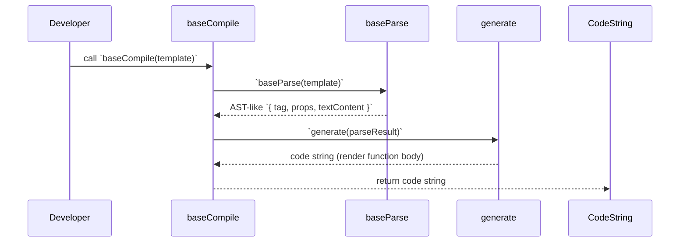
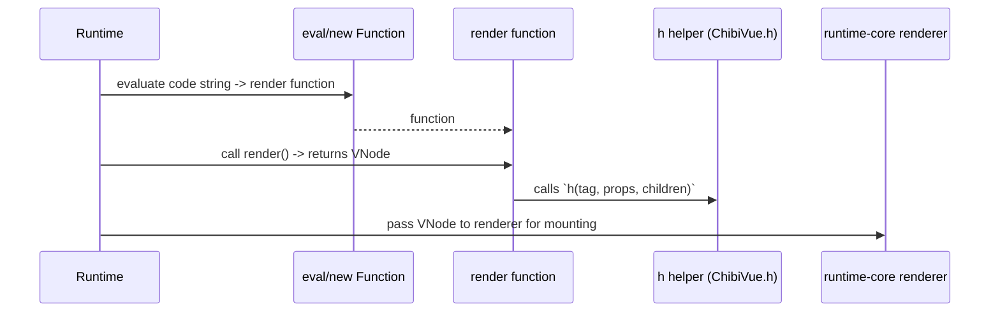

# compiler-core

## 概要

`compiler-core` パッケージは単純なテンプレート文字列をパースして、ランタイムで実行可能な JavaScript コード（レンダリング関数を返す文字列）を生成する小さなコンパイラのコアを提供します。

このプロジェクトでは教育目的かつ最小実装として、テンプレート構文のサポートは限定的で、単一タグと属性、テキストコンテンツを扱う程度に留まりますが、コンパイラの役割と各工程（パース・コード生成）の関係は学べます。

## 責務と設計方針

- 明確な段階分離: パーサ（`baseParse`）はテンプレートを解析して構造化データを返し、コードジェネレータ（`generate`）はその構造から文字列化されたレンダラコードを生成します。コンパイルは `baseCompile` がこれらを繋ぐのみです。
- シンプルさ優先: 実装は可読性と最小限の依存性を重視しており、複雑な AST を持たず、必要最小限の表現（tag, props, textContent）を扱います。
- 明確な拡張点: 現状のパイプラインは拡張しやすく、将来的に属性式、式展開、子ノードの配列、ディレクティブや v-bind などを段階的に追加できます。

## 主なファイル

- `parse.ts` — `baseParse(template)`。正規表現ベースの簡易パーサで、タグ名、属性（name="value" 形式）、テキストコンテンツを抽出して `{ tag, props, textContent }` を返します。
- `codegen.ts` — `generate(ast)`。パース結果からレンダリング用の関数文字列を作成します（現在は `h` ヘルパーを使うコードを返す）。
- `compile.ts` — `baseCompile(template)`。`baseParse` と `generate` を組み合わせて最終的なコード文字列を返します。
- `index.ts` — パッケージのエントリ（`export { baseCompile } from './compile'`）。

## コンパイル／実行の流れ（高レベル）

1. 開発者がテンプレート文字列（例: `<div id="app">Hello</div>`）を `baseCompile(template)` に渡す。
2. `baseParse` が文字列を解析して構造化データ `{ tag, props, textContent }` を生成する。
3. `generate` が構造化データからレンダラ関数を文字列で生成する（例: `return () => { const { h } = ChibiVue; return h("div", { id: "app" }, ["Hello"]); }`）。
4. （実行側）生成された文字列は `new Function(code)()` あるいはバンドル時に評価され、レンダラ関数を得てランタイムに渡される。

### シーケンス図: コンパイル時の流れ



### シーケンス図: 実行時の流れ（コンパイル結果を評価してレンダリング）



## 実装上の注意点と制約

- 現状の `parse.ts` は正規表現ベースの非常に単純な実装であり、入れ子構造、複雑な属性値、式展開、複数子ノードなどは正しく処理できません。
- `generate` は文字列コードを返します。安全に評価するには信頼されたテンプレートのみを扱うか、追加のサニタイズ・検証が必要です。
- 拡張ポイントとしては、AST を明示的に導入してノードツリーを表現し、複数子ノードや式（`{{ count }}`）の評価、ディレクティブ処理、最適化パス（静的木の検出）などを追加すると良いです。

## 開発者向けメモ

- 小さなテンプレートを試してコンパイル → 実行の一連を追うとコンパイラの流れが理解しやすいです。例:

```ts
import { baseCompile } from "packages/compiler-core";
const code = baseCompile('<div id="app">Hello</div>');
// evaluate the returned code string to obtain a render function
const render = new Function(code)();
const vnode = render();
```

- 将来的に安全性や表現力を高める場合は、AST の導入、トークナイザの追加、コード生成のテンプレート化（プリティファイ）などを検討してください。

---

この README は S 設計方針・ファイル構成・実行フロー・拡張点を明示しています。実装を追う順は `parse.ts` → `codegen.ts` → `compile.ts` です。
