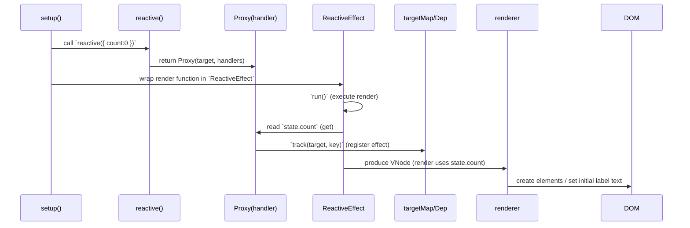
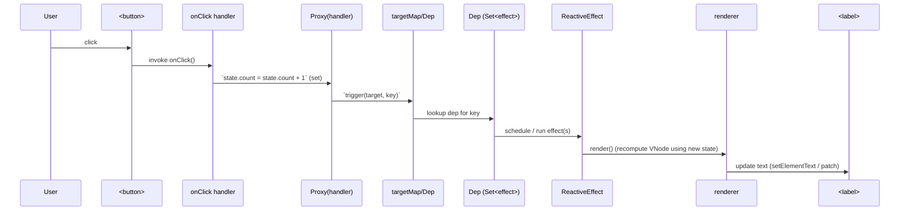

# reactivity

## 概要

`reactivity` パッケージは、このミニランタイムで使われるリアクティブシステムを実装しています。
目的は「通常のオブジェクトを監視可能にし、依存関係が変化したら自動的に処理（副作用）を再実行する」ことです。

## 実現の要点（設計思想）

- Proxy ベース: 生のオブジェクトを直接書き換えるのではなく、`Proxy` を用いてプロパティの読み取り／書き込みを傍受します。これにより既存のオブジェクトをほぼそのまま使いながらリアクティブ化できます。
- 依存の自動収集（track）: エフェクト（副作用関数）を実行する際に、実行中のエフェクトを `activeEffect` として記録します。プロパティの `get` ハンドラ内で `track(target, key)` を呼ぶことで、どの effect がそのプロパティに依存しているかを自動的に収集します。
- 変更通知（trigger）: プロパティの `set` ハンドラでは、値が変化した場合だけ `trigger(target, key)` を呼び、当該プロパティに依存する effect を再実行します。変更判定には `Object.is` 相当の `hasChanged` を使います。
- 最小限のメモリ負荷: 依存データは `WeakMap<object, Map<key, Dep>>` として保持します。ターゲットオブジェクトがガベージコレクトされると関連データも解放されます。
- Dep は Set: 依存する effect の集合は `Set<ReactiveEffect>`（ファイアする順序を固定しない）で表します。
- ネストしたオブジェクトもリアクティブ化: `get` の戻り値がオブジェクトであれば `reactive(res)` を返すことで遅延リアクティブ化（lazy wrapping）を行い、ネストした変更も監視できます。
- 実行コンテキストの復帰: effect 実行中に別の effect を呼ぶ（ネスト）可能性があるため、`run` 実行前に現在の `activeEffect` を一時保存し、実行後に復帰させています。

## 主なファイル（実装参照）

- `index.ts` — パッケージのエントリ（`export { reactive } from './reactive'`）。
- `reactive.ts` — `reactive` API の実体（`new Proxy(target, mutableHandlers)` を返す）。
- `baseHandler.ts` — `Proxy` の `get` / `set` ハンドラ実装（`track` / `trigger` を呼び出す、ネストの reactive 化、Reflect を用いた安全なアクセス等）。
- `effect.ts` — `ReactiveEffect` クラス、`track` / `trigger` ロジック、`activeEffect` の管理、targetMap（WeakMap）など。
- `dep.ts` — `Dep` 型と `createDep` ヘルパー（`Set<ReactiveEffect>` を作る）

## 簡単なフロー（高レベル）

1. `reactive(obj)` を呼ぶと `Proxy(obj, handlers)` を返す。
2. ある effect を実行する際、`activeEffect` にその effect を設定して実行する（`ReactiveEffect.run()`）。
3. effect 内で reactive オブジェクトのプロパティを読むと `get` ハンドラが呼ばれ、`track(target, key)` により targetMap に `activeEffect` が登録される。
4. 後でそのプロパティに対して `set` が行われ、値が変わっていれば `trigger(target, key)` により登録された effect を再実行する。

## 現状で未実装／拡張しやすい点

- `computed`／`watch` の便利 API は未実装（将来的に導入可能）。
- effect の停止（`stop`）やスケジューラ（優先度や非同期バッチ処理）の導入は現状ではないが、`ReactiveEffect` にスケジューラを渡す拡張が自然です。
- トランザクション的なバッチ更新（複数変更をまとめて 1 回だけ再実行）や非同期スケジューリングは追加で実装可能。

## 実装上の注意点（読み手向け）

- `baseHandler` の `get` では `track` を呼んだあとで `Reflect.get` を使って値を取り出しています。`Reflect` を使うことで `receiver` を正しく保ち、継承や `this` の扱いを意図どおりにできます。
- ネストしたオブジェクトはアクセス時に遅延で `reactive` に包まれるため、全オブジェクトを一括で Proxy 化する必要はありません。
- `effect.run()` は実行前に現在の `activeEffect` を保存し、実行後に復帰させます。これにより effect のネスト時に正しい依存収集が行われます。

## 開発者向けメモ

- 単体テスト: `effect` の登録／解除、`track`／`trigger` の挙動、ネストした reactive の挙動、`hasChanged` による不要再実行の抑止を重点的にテストしてください。
- 拡張: `ReactiveEffect` に `scheduler` を渡すと、再実行のタイミングをコントロールできます（`scheduler` によりバッチ処理や非同期更新が容易になります）。

---

実装ファイルを読むと設計思想が把握しやすいです: `reactive.ts` → `baseHandler.ts` → `effect.ts` → `dep.ts` の順がおすすめです。

## シーケンス図: 生成と初期描画の流れ

以下はシンプルなカウンター例（ラベルで値を表示し、ボタンのクリックで値をインクリメントする）を想定した、リアクティブ生成から初回レンダリングまでの流れです。

上記では、`ReactiveEffect.run()` が実行中に `get` が呼ばれるため、`track` により effect が `targetMap` に登録されます。これが後で `set` による再実行（更新）を可能にします。

## シーケンス図: ボタンクリックによる更新の流れ

次はユーザーがボタンをクリックしてカウントを増やし、ラベルが更新されるまでの流れです。

この更新経路の重要点:

- `Proxy.set` は値が変化したときのみ `trigger` を呼びます（`hasChanged` を使用）。
- `trigger` は `targetMap` を辿って、当該プロパティに依存している effect を取り出し再実行します。
- effect の再実行はレンダリングやその他の副作用を再度走らせ、最終的に DOM を更新します。

## 補足: 実際のレンダラ統合

このミニ実装ではレンダラ（`runtime-core` / `runtime-dom`）が直接 effect を自動的にラップする仕組みは最小実装として簡略化されている可能性があります。実際のアプリケーションでは次のいずれかの方式で統合されます:

- レンダリング関数を `ReactiveEffect` としてラップしておき、初回レンダリングで依存を収集しておき、`trigger` 時に再実行する。
- `ReactiveEffect` に `scheduler` を渡し、更新をバッチングして効率的に再レンダリングする。

---
